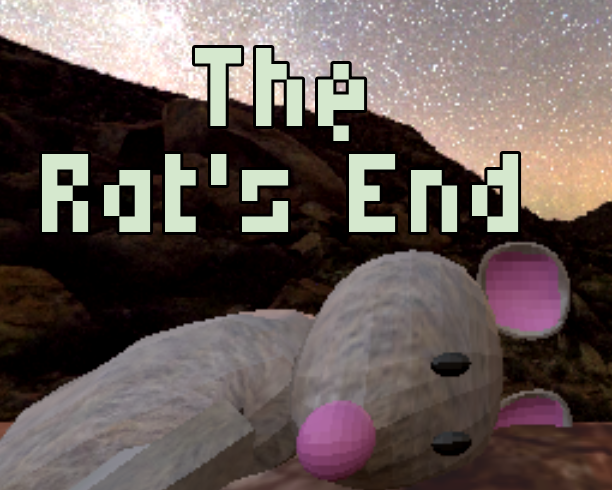
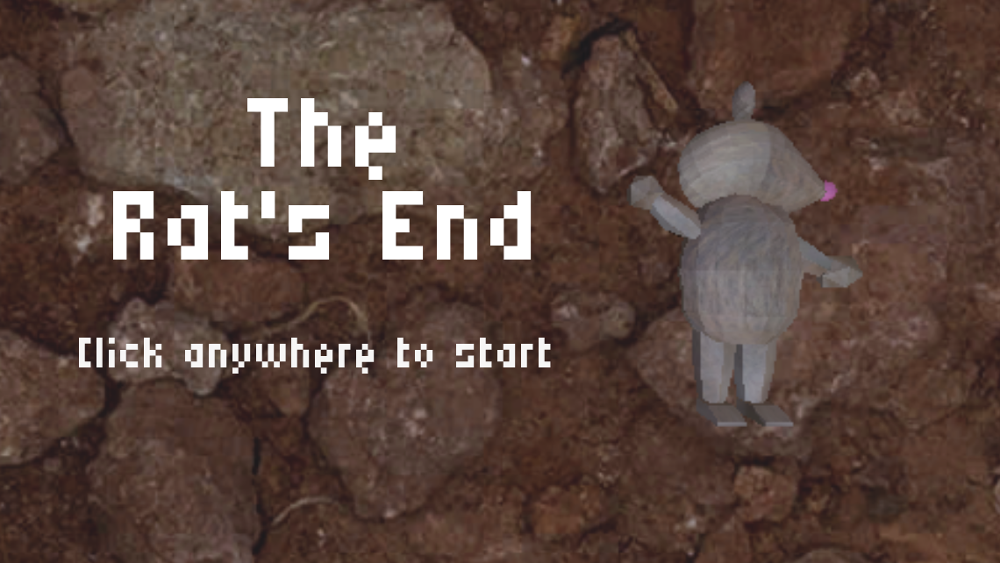
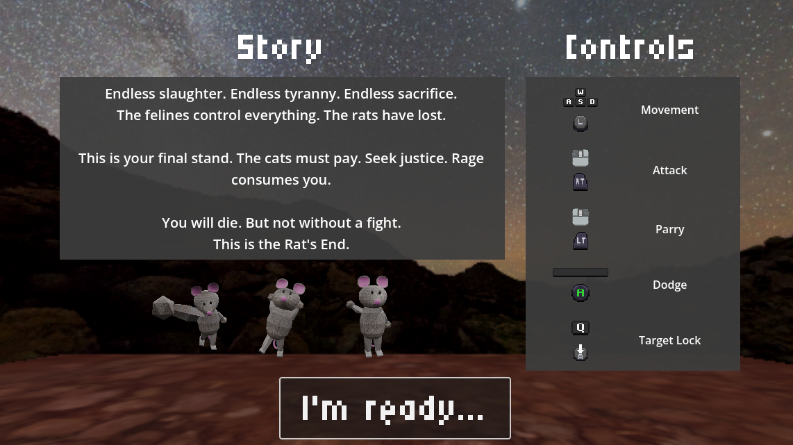
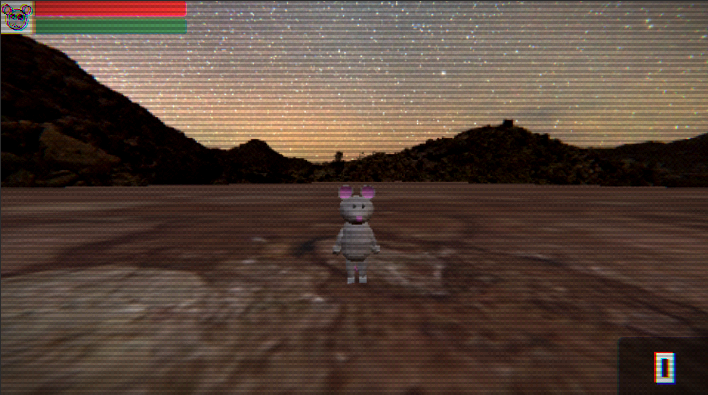
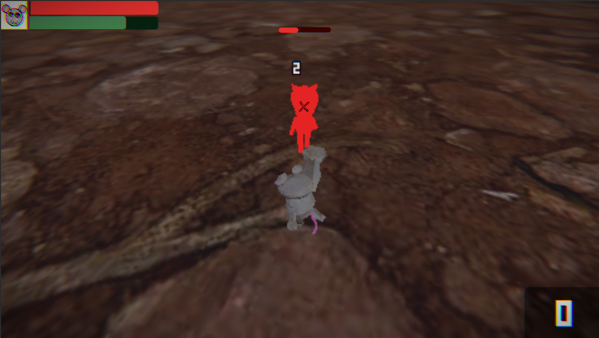
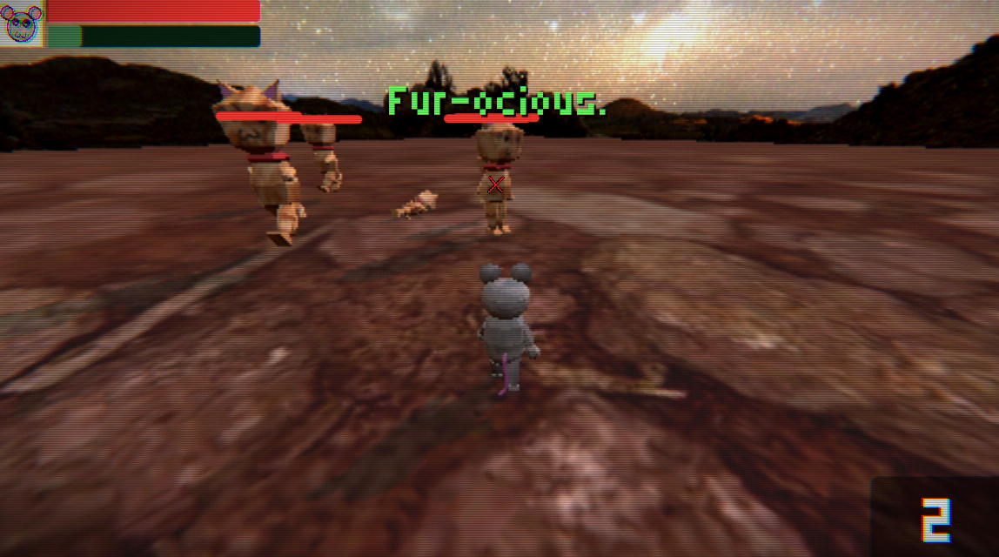
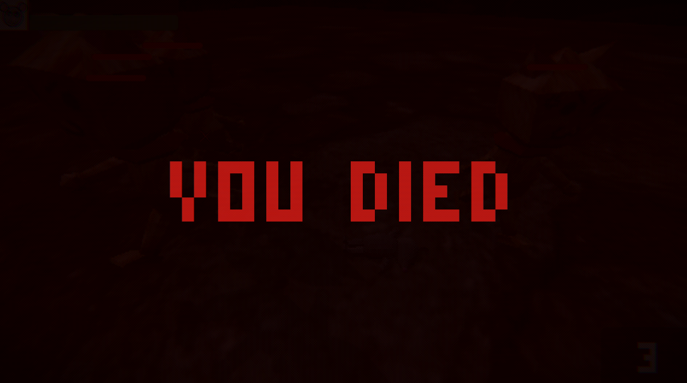

  

  # The Rat's End

  **A fast-paced, PS1-styled action-narrative experience.**

  

---

**The Rat's End** is a stylised, retro-inspired action game combining high-impact combat with a branching narrative. Built in Godot, it features a custom PS1 aesthetic, dynamic difficulty scaling, and a data-driven dialogue system that responds to player choices.

## 📸 Screenshots

  
  
  
  
  
  

## ✨ Key Features

- **High-Impact Game Feel:** Tight, responsive combat enhanced with screen shake, hitstop mechanics, combo counters, and dynamic visual effects.
- **Dynamic Difficulty System:** An intelligent enemy spawner that scales the enemy cap and spawn rates proportionally to the player's score, ensuring a smooth yet challenging progression curve.
- **PS1-Retro Aesthetic:** Custom-written shaders to faithfully recreate the visual artifacts of the PS1 era, complete with post-processing and vertex wobble.
- **Persistent Player Settings:** Fully integrated UI configurations, saving player preferences for sensitivity and audio mixing (Master/Music/SFX) across sessions.

## 🚀 Running Locally

1. Clone the repository.
2. Open the project in **Godot 4.x**.
3. Press `F5` or click the Play button to run the game!

---

*Thank you for checking out The Rat's End! Feel free to play the game on [itch.io](https://tabyrocket.itch.io/the-rats-end) or explore the source code.*
